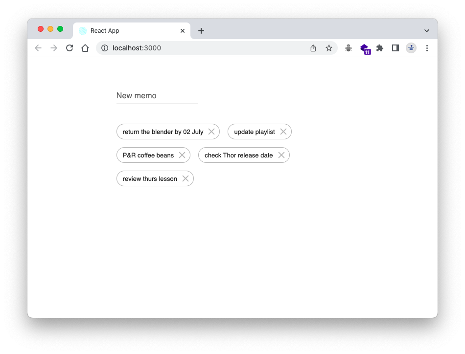
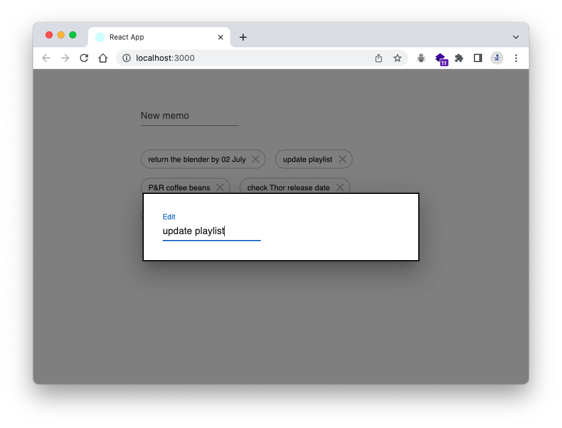

# Simple Memo - client side

This is a simple memo app in web version inspired by [Blink](https://apps.apple.com/us/app/blink-quick-memo-widget/id1182856129)

## Demo

👉 Here's the deployed app: [front end](https://simple-memo.netlify.app/)

## Preview

## Features

- Create, read, edit, and delete memos
  - Create a memo using input field
  - Once there's any data in the DB, the memo list will be shown behind the input area
  - Click the individual memo to edit
  - Once clicking, a popup window created with modal component from MUI will be displayed
  - Delete a memo by click the check icon

## Tech Stack

- React and its frameworks and libraries
  - axios for HTTP requests to implement CRUD features
  - MUI for layouts and styling components
- MongoDB Atlas for storing and retrieving data
- Mongoose for connecting between MongoDB and Express

## Installation

- Clone this repo
- Run this command line in your terminal, `npm install` to install the dependencies defined in package.json
- Execute the server using `npm start` and it will run your localhost port 3000
- To get the stored data in MongoDB, please clone [server-side repo](https://github.com/aanmeba/simple-memo-server) separately and follow the instruction

## Room for improvement

- Refresh the page when create or delete a memo
  - Since it reaches the DB, refreshing the page seems inevitable, but try other ways
- Edit field could appear the place where the memo is, not a form of the popup
